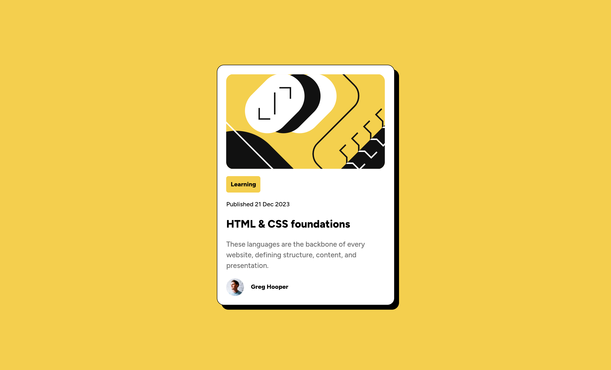

# Frontend Mentor - Blog preview card solution

This is a solution to the [Blog preview card challenge on Frontend Mentor](https://www.frontendmentor.io/challenges/blog-preview-card-ckPaj01IcS). Frontend Mentor challenges help you improve your coding skills by building realistic projects.

## Table of contents

-   [Overview](#overview)
    -   [Screenshot](#screenshot)
    -   [Links](#links)
-   [My process](#my-process)
    -   [Built with](#built-with)
-   [Author](#author)

## Overview

### Screenshot

### Links

-   [Solution on Frontend Mentor](https://www.frontendmentor.io/solutions/frontend-mentor---blog-preview-card-solution-htmlscss-24HEcmJGOH)
-   [Live Site](https://wolf-root.github.io/Frontend-Mentor-Blog-preview-card/)

## My process

### Built with

-   HTML5
-   Scss
-   Flexbox

## Author

-   Website - [My Portfolio](https://yousseffed.vercel.app/)
-   Frontend Mentor - [Wolf-Root](https://www.frontendmentor.io/profile/Wolf-Root)
-   Twitter - [wolf_R00T](https://x.com/wolf_R00T)
